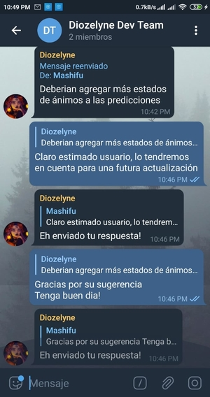

<div align="center">
  
  <h1>DiozelyneAI</h1>
  <p>
    <b>El bot de telegram que deduce tu estado de animo ⚡️</b>
  </p>
  <p>
    
    
    
    
    </p>
      <p>
        <a href="https://replit.com/@crishan0531/DiozelyneAI" target="_blank"></a>
      </p>
    <br>
    <br>
    <br>
</div>

Diozelyne es una IA que detecta tu estado de ánimo mediante notas de voz.

Interactúa con el bot [_desde aqui_](https://t.me/DiozelyneBot)

## Tabla de Contenidos

- [Chat de usuario](#chat)
- [Comandos](#comandos)
- [Instalación](#instalacion)

## Chat de usuario

 

## Chat de admin



## Comandos 

### Comandos del usuario

#### 1: /start

  Iniciar el bot

#### 2: /help 

  Mostrar los comandos del bot 

#### 3: /emotion

  Reconocer tu estado de ánimo 

#### 4: /feedback

  Reporte de bugs y hacer sugerencias

### Comandos del admin

#### 1: /block

  Se le bloquea la opcion de enviar sugerencias al usuario

#### 2: /unblock 

  Se le revoca el bloqueo del comando

## Instalación

### Instalar en Repl.it
[](https://replit.com/@crishan0531/DiozelyneAI)

En el apartado de ***Secrets (Environment Variables)*** creamos las variables:

`TOKEN` - Este es el token con el cual funcionará el bot.
Puede obtener uno con [@BotFather](https://t.me/botfather)

`ADM_CHAT` - Este es el id del canal donde se enviarán las sugerencias

Ejecutamos el bot desde el botón **Run**, las dependencias se instalarán automáticamente


### Instalación local

Clonamos el repositorio
```
$ git clone https://github.com/DevsExpo/FridayUserbot
```
Instalamos las dependencias
```
$ pip3 install -r requirements.txt
```
Creamos un archivo **.env** con los siguientes valores

`TOKEN` - Este es el token con el cual funcionará el bot.
Puede obtener uno con [@BotFather](https://t.me/botfather)

`ADM_CHAT` - Este es el id del canal donde se enviarán las sugerencias

Ejecutamos el bot
```
$ python3 main.py
```

## Créditos

[igoose1 - support-bot](https://github.com/igoose1/support-bot)

[Kenterbery - emotier_tg_bot](https://github.com/Kenterbery/emotier_tg_bot)

## Licencia
[](https://github.com/Mashi31/DiozelyneAI/blob/master/LICENSE.md)
```
MIT License

Copyright (c) 2021 Momashi Arts

Permission is hereby granted, free of charge, to any person obtaining
a copy of this software and associated documentation files (the
"Software"), to deal in the Software without restriction, including
without limitation the rights to use, copy, modify, merge, publish,
distribute, sublicense, and/or sell copies of the Software, and to
permit persons to whom the Software is furnished to do so, subject to
the following conditions:

The above copyright notice and this permission notice shall be
included in all copies or substantial portions of the Software.

THE SOFTWARE IS PROVIDED "AS IS", WITHOUT WARRANTY OF ANY KIND,
EXPRESS OR IMPLIED, INCLUDING BUT NOT LIMITED TO THE WARRANTIES OF
MERCHANTABILITY, FITNESS FOR A PARTICULAR PURPOSE AND
NONINFRINGEMENT. IN NO EVENT SHALL THE AUTHORS OR COPYRIGHT HOLDERS BE
LIABLE FOR ANY CLAIM, DAMAGES OR OTHER LIABILITY, WHETHER IN AN ACTION
OF CONTRACT, TORT OR OTHERWISE, ARISING FROM, OUT OF OR IN CONNECTION
WITH THE SOFTWARE OR THE USE OR OTHER DEALINGS IN THE SOFTWARE.
```
